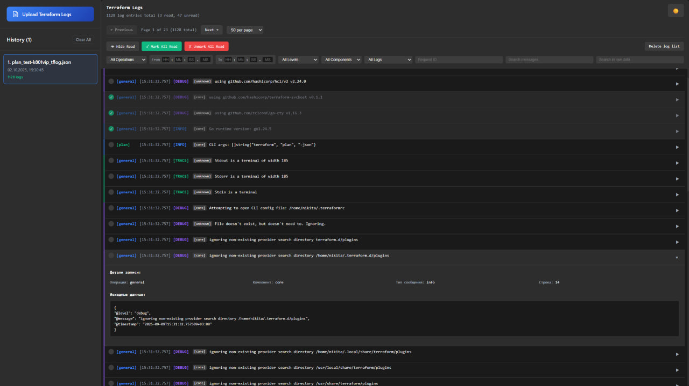

<h1 align = "center">Terraform log-viewer</h1>

<h3 align = "center">For T1 Hackaton (Pawsy Studio)</h3>
 

> [!NOTE]
> DockerReady version: <a href = "https://github.com/1CE-CAT/Hakaton-terraform-logs/tree/main">here</a>

<h3>Stack: React(Vite) JS, Python + Django</h3>

<ul>
<li>Django (Python required):</li>
    <ul><li>in api directory:</li>
        <code>pip install django</code> 
        <code>python manage.py runserver</code>
        </ul>
 <li>React (Node.JS required):</li>
    <ul><li>in terra-form directory:</li>
    <code>npm i</code> 
    <code>npm run dev</code></ul>
</ul>
